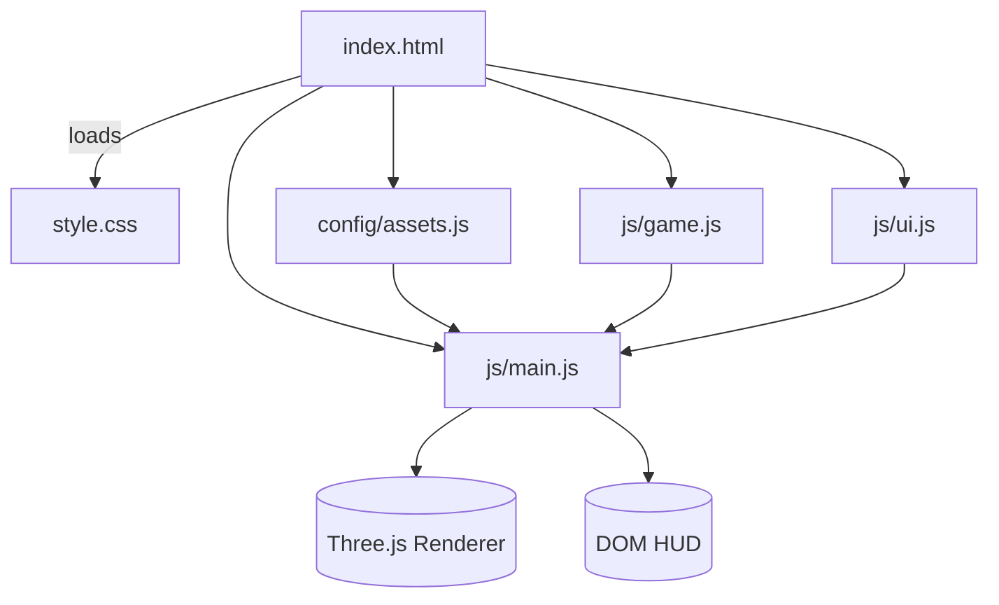
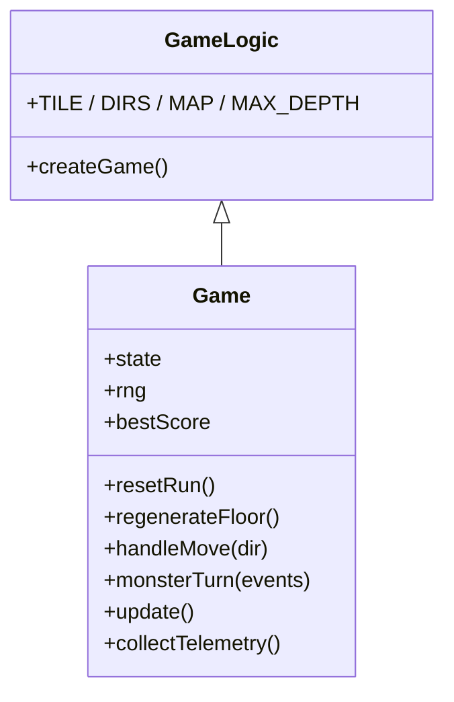
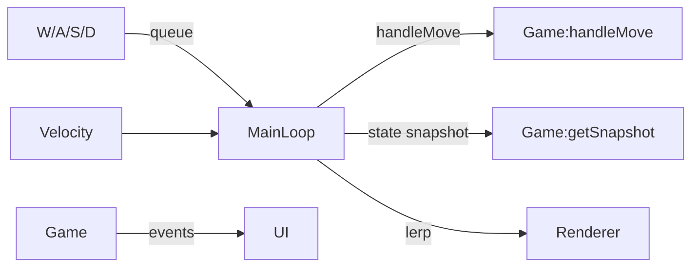
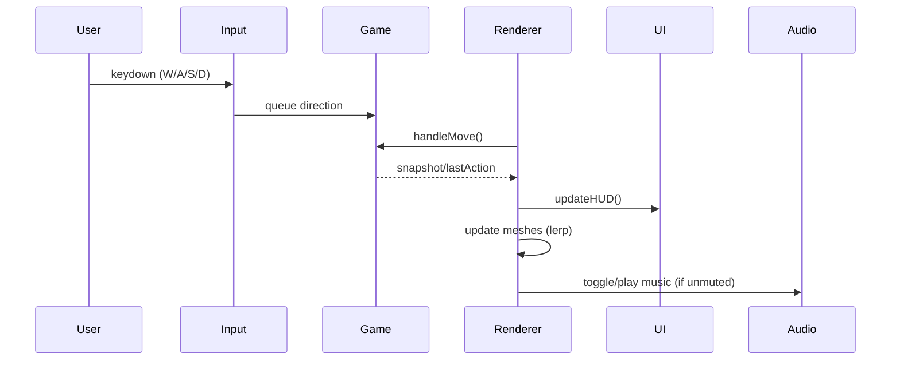

# Dungeon Delver Architecture

This document summarizes the overall structure of the Dungeon Delver prototype, focusing on the current Three.js-based implementation.

## High-Level Overview



- `index.html` links all runtime scripts and the stylesheet.
- `config/assets.js` defines configurable asset overrides (textures, models, audio) exposed via a global `ASSETS` object.
- `js/game.js` encapsulates mechanics, procedural generation, and state transitions.
- `js/ui.js` manages HUD elements, overlays, and debug readouts.
- `js/main.js` orchestrates rendering, input handling, audio, and the bridge between game logic and UI.

## Core Modules

### Game Logic (`js/game.js`)

The game module exposes a `GameLogic` namespace with constants and a factory, providing a clean interface to the rest of the app.



Key responsibilities:

- Procedural map generation with room carving, corridor linking (minimum-spanning approach + extra loops), trap/door sprinkling, and farthest-floor stair placement.
- Turn-based movement: the player moves one tile per input, monsters respond in discrete turns using line-of-sight activation.
- Combat resolution, XP, leveling, and persistence for best floor reached.
- Collection of telemetry for debug overlays.

Supporting utilities: deterministic RNG (`mulberry32`), room helpers (`makeRoom`, `roomsOverlap`), BFS (`findFarthestFloor`), and monster stat scaling.

### UI Layer (`js/ui.js`)

Provides DOM references and basic setters:

- HUD updates for HP/XP bars, floor, keys, level.
- Pause & restart overlays, audio toggle button, and debug panel.
- Simple interface for external modules via `UI.init` with callbacks.

### Rendering & Input (`js/main.js`)

Responsibilities include:

- Initializing Three.js renderer, scene, camera, lights, and audio.
- Building tile meshes, star-shaped monsters, and the cone placeholder player mesh.
- Maintaining smoothed presentation state (lerp-based for player/camera/glow) while querying discrete game snapshots.
- Handling WASD movement, queueing inputs, and synthesizing turn ticks constrained by a move cooldown.
- Synchronizing monster meshes, performing rotations, and managing the animation loop.
- Integrating HUD hooks, debug output, and the music playback toggle.



### Asset Configuration (`config/assets.js`)

Defines a global `ASSETS` object to allow future overrides:

- Textures, models, and audio slots default to `null` (procedural placeholders).
- Post-processing preference (bloom) captured for future integration.
- Comments describe expected file formats and size guidelines.

## Data Flow Summary

1. **Initialization**: `main.js` loads config, game, and UI modules, sets up rendering, and starts the loop.
2. **Input**: Keyboard events populate a move queue processed during fixed updates (`1/60s`).
3. **Game Step**: `game.handleMove` and `game.monsterTurn` mutate state per turn; events (combat, doors, depth) are recorded.
4. **Presentation**: Each frame, `main.js` pulls a snapshot, smooths positions, updates meshes/HUD, and writes debug info.
5. **Persistence**: Depth progression updates `localStorage` (`bestScore`).



## File Layout

```mermaid
graph TD
  root[/project root/]
  root --> assets
  assets --> audio
  audio --> music
  music --> file1[DungeonEchoes.mp3]
  root --> config
  config --> assetsjs[assets.js]
  root --> js
  js --> main[js/main.js]
  js --> game[js/game.js]
  js --> ui[js/ui.js]
  root --> vibe[vibe_resources]
  vibe --> placeholders[vibe_resources/placeholders.md]
  vibe --> arch[vibe_resources/architecture.md]
  root --> style[style.css]
  root --> index[index.html]
```

## Potential Future Features

- **Fog of War / Dynamic Lighting**: Implement a shader-driven vignette or light radius tied to the player.
- **Asset Overrides**: Auto-detect `ASSETS` URLs to swap models, textures, and sound effects at runtime.
- **Animation System**: Replace the placeholder player mesh with animated character models or sprite sheets.
- **Bloom & PostFX**: Switch to ES module builds and wire `EffectComposer` + `UnrealBloomPass` to honor the bloom preference.
- **Expanded Entities**: Add loot chests, ranged enemies, or environmental props to diversify dungeon layouts.
- **Settings Persistence**: Extend localStorage usage for audio/effects toggles and future accessibility options.
- **Save/Resume Runs**: Serialize deeper game state to allow mid-run saves.
